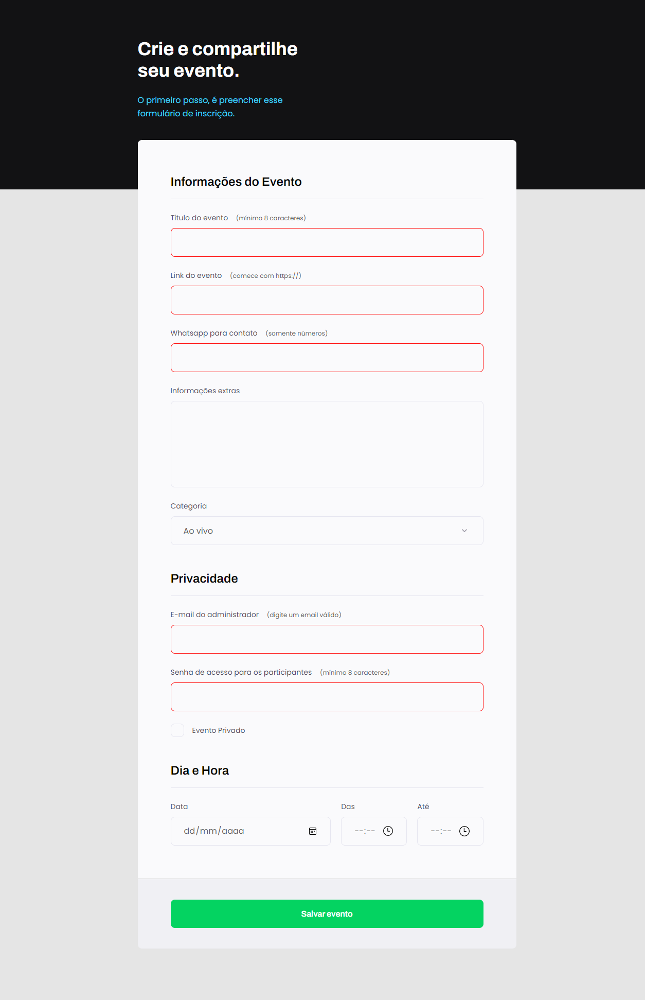

<h1 align="center"> Formulário de Eventos </h1>

Um Página para formulario de eventos feito para 💻 Desktop, feito em conjunto com a Rocketseat 🚀 no módulo: Avançando em HTML e CSS, do Explorer (stage-03). 

  <a href="#-tecnologias">Tecnologias</a>&nbsp;&nbsp;&nbsp;|&nbsp;&nbsp;&nbsp;
  <a href="#-projeto">Projeto</a>&nbsp;&nbsp;&nbsp;|&nbsp;&nbsp;&nbsp;
  <a href="#-layout">Layout</a>&nbsp;&nbsp;&nbsp;|&nbsp;&nbsp;&nbsp;
  <a href="#memo-licença">Licença</a>

  

 

  

## 🚀 Tecnologias

Esse projeto foi desenvolvido com as seguintes tecnologias:

- HTML
- CSS
- Github

## 💻 Projeto

Um Formulário para desktop feito com HTML e CSS. Esse projeto faz parte da Rocketseat 🚀 Explorer

## 🔖 Layout

Você pode visualizar o layout do projeto através [DESSE LINK](https://www.figma.com/file/8thZFt6BzVXeyCqCU2MCoO/Explorer-Stage-03-Projeto-01-(Copy)). É necessário ter conta no [Figma](https://figma.com) para acessá-lo.

## :memo: Licença

Esse projeto está sob a licença MIT.

---

Feito com ♥ by Daniel Sales/Rocketseat :wave: [Participe da  comunidade!](https://discord.gg/rocketseat)
